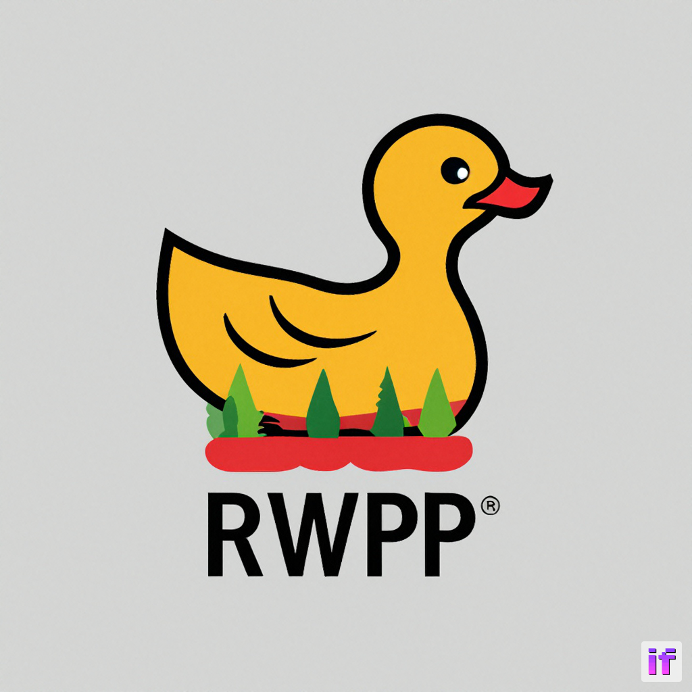

# A Beginner's Guide to Using RWPP: Downloading Reddit Photos Made Easy!


*Image generated using [DeepFloyd IF](https://huggingface.co/DeepFloyd)*.

*"Logo" only for demonstration purposes and has no intent of commercial use.*

> **Note: Currently, [RWPP](https://git.duckylabs.xyz/DuckyLabs/rwpp) is only available for Linux systems. Windows support is currently in development and will be available soon.**

Welcome to the beginner's guide to using RWPP (Reddit Wallpaper Photo Downloader)! In this guide, we'll walk you through the basic steps of installing and running RWPP on your Linux system. With RWPP, you'll be able to effortlessly download stunning photos from your favorite subreddits. Let's get started!

## Prerequisites & Installation

Before we dive into the installation process, check that you have [Python](https://python.org) installed on your Linux system. Most distributions come with it pre-installed, though you may still have to install the relevant `python-pip` package available through your package manager. Ensure you have `python` and `pip` on the system and accessible from the command line. Follow these simple steps to get it up and running:

1. Open a terminal on your Linux system.
2. Type the following command to install the RWPP program using pip:

   ```bash
   pip install rwpp
   ```


   This command will download and install the necessary files for RWPP.

## Running RWPP

Now that you have RWPP installed on your system, let's learn how to run it and start downloading those awesome Reddit photos! Here's what you need to do:

1. Open a terminal on your Linux system.
2. Type the following command to run the RWPP app, replacing `subreddit` with the name of the desired subreddit you want to download photos from:

   ```bash
   rwpp subreddit
   ```


   This command will launch the RWPP app and prompt you for further input.

3. RWPP will now ask you for the number of images you want to download, the directory to save the photos in, and the filter to sort by (hot, new, top, rising). If you've selected the `top` filter, RWPP will also ask for the time filter (hour, day, week, month, year).

   Enter the desired values according to your preferences.

4. Once you've provided the necessary information, RWPP will start downloading the photos from the selected subreddit. Sit back, relax, and let RWPP do its magic!

   **Note:** RWPP ensures that duplicate photos are not downloaded from the same subreddit, so you don't have to worry about cluttering your storage.


## Planned Features and Improvements

As an ongoing project, RWPP is continuously being improved and enhanced. Here are some of the features and improvements I plan to work on in future releases:

- Currently, the program doesn't understand that the `~` character means the home directory on Linux. I aim to enhance RWPP to recognize the tilde and save files appropriately.

- I plan to implement better error handling for subreddit validation. RWPP will be able to check if the given subreddit exists or properly handle the errors thrown when it doesn't find one.

- In a future update, RWPP will allow you to pass in multiple subreddits. This feature will enable the program to line them up for execution, downloading photos from each subreddit one after the other.

- I are working on introducing a global configuration file feature. This will allow you to set your preferred settings in a configuration file located at `~/.config/rwpp.conf` or `~/.rwpp.conf`. [RWPP](https://git.duckylabs.xyz/DuckyLabs/rwpp) will read these settings and use them as default values for future runs.

- Additionally, I plan to introduce the ability to specify a custom location for the configuration file using a flag such as `-c` or `--config`. This will provide flexibility for users who prefer to store their configuration files in a different directory.

I am committed to making RWPP one of the best Reddit photo downloaders out there, and these planned features will enhance its functionality and user experience. Feel free to get in touch and tell me what features and improvements you'd like to see for the project.

## Open Source and Acknowledgments

[RWPP](https://git.duckylabs.xyz/DuckyLabs/rwpp) is an open-source program, which means you can contribute to its development or create your own fork. To follow development more closely or to fork/contribute to the project, find the [source repo here](https://git.duckylabs.xyz/DuckyLabs/rwpp), located on a self-hosted instance of [Forgejo] (a community mainted fork of [Gitea](https://gitea.io)).

I want to give a special shout out to the developers of the [Typer](https://typer.tiangolo.com/) and [Redditwarp](https://github.com/Pyprohly/redditwarp) Python packages for their valuable *indirect* contributions by providing such lovely libraries to work with.

I hope this guide has helped you get started with [RWPP](https://git.duckylabs.xyz/DuckyLabs/rwpp). Now go ahead, explore your favorite subreddits, and download those breathtaking photos with ease. Enjoy!


